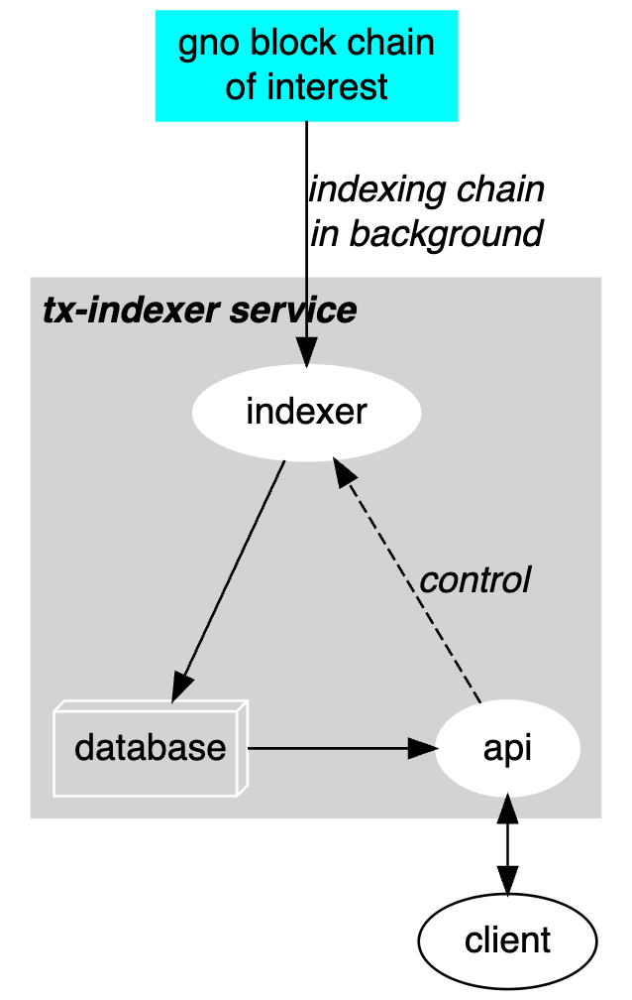

## Using tx-indexing filters

This example uses the tx-indexing service to find transactions that cost over 5,000,000 gas within a chain.

*Note: This example indexes the text chain at `http://test3.gno.land:36657`, as used in the 
[tx-indexer Getting Started](https://github.com/gnolang/tx-indexer/blob/ae33bd64265d47f8c3871ac491d2ba60edb44e58/README.md#getting-started).*

The tx-indexer service provides a utility to index a specified chain, as well as an API to manage the indexing and query the index data. The following diagram depicts this idea:



This example shows how to use the graphql endpoint to retrieve index data extracted by the tx-indexer service.
The example takes you through the following activities:

1. Install and start the tx-indexer service.
2. Query the API for transactions using > 5 million gas.
 
These activities are described in the following sections.

### Install and start the service

In a shell window, open and start the service as described in the following steps (these are similar to those in the
[Getting Started](https://github.com/gnolang/tx-indexer/blob/ae33bd64265d47f8c3871ac491d2ba60edb44e58/README.md#getting-started)).

1. **Clone the Repository**

```bash
git clone https://github.com/gnolang/tx-indexer.git 
```

2. **Build the binary**

```bash
cd tx-indexer
make build
```

3. **Run the indexer**

```bash
./build/tx-indexer start --remote http://test3.gno.land:36657 --db-path indexer-db
```

This starts up the tx-indexer service, indexing the test3.gno.land example chain. Leave this running a little while it indexes the existing contents of the chain; then leave it running to continue indexing new transactions as they are added.

### Use the service to request filtered transactions

With the tx-indexer running, you can make a request against the service's RPC or graphql endpoints. This example uses the graphql endpoint, and assumes that the `jq` shell command is available.

**Step 1: create the query** &mdash; Create a JSON file named `request.json`, with content shown below.

```
{
  "query": "query {
    transactions(
      filter: { from_gas_used: 5000000}
    ) {
      block_height
      hash
      gas_used
      messages {
        route
        typeUrl
        value {
          __typename
          ... on MsgAddPackage {
            creator
            package {
              name path
            }
          }
        }
      }
    }
  }"
}
```

**Step 2: Post the query** &mdash; Next, execute the following command to post the JSON request to the service's graphql endpoint:

```bash
curl -d @request.json --header "Content-Type: application/json" http://0.0.0.0:8546/graphql/query | jq 
```

**Step 3: See the result** &mdash; The service should return output similar to the following:

```
{
  "data": {
    "transactions": [
      {
        "block_height": 135249,
        "hash": "YFgFEz6NZJBDaVwLHZXWeDVjUjJQfvNUT+dnqoqDT3A=",
        "gas_used": 7496696,
        "messages": [
          {
            "route": "vm",
            "typeUrl": "add_package",
            "value": {
              "__typename": "MsgAddPackage",
              "creator": "g1juz2yxmdsa6audkp6ep9vfv80c8p5u76e03vvh",
              "package": {
                "name": "boards",
                "path": "gno.land/r/demo/jefft0_test1_boards"
              }
            }
          }
        ]
      },
      {
        "block_height": 136299,
        "hash": "oE/P0WiTrlnm6qVTHi0JF1LZ9JOPjSV6xyIAdtfSYQk=",
        "gas_used": 7496539,
        "messages": [
          {
            "route": "vm",
            "typeUrl": "add_package",
            "value": {
              "__typename": "MsgAddPackage",
              "creator": "g1juz2yxmdsa6audkp6ep9vfv80c8p5u76e03vvh",
              "package": {
                "name": "boards",
                "path": "gno.land/r/demo/jefft0_test2_boards"
              }
            }
          }
        ]
      }
    ]
  }
}
```

This returned data lists the requested fields for all transactions that satisfy the filter; in this case, where gas is greater than 5,000,000.


https://dreampuf.github.io/GraphvizOnline/#digraph%20G%20%7B%0A%0Anode%20%5Bfontname%3D%22helvetica%22%5D%0Aedge%20%5Bfontname%3D%22helvetica-oblique%22%5D%0Agno_chain%0A%0Aclient%0A%0A%20%20subgraph%20cluster_0%20%7B%0A%20%20%20%20style%3Dfilled%3B%0A%20%20%20%20color%3Dlightgrey%3B%0A%20%20%20%20node%20%5Bstyle%3Dfilled%2Ccolor%3Dwhite%5D%3B%0A%20%20%20%20indexer%20database%20api%0A%20%20%20%20label%20%3D%20%22process%20%231%22%3B%0A%20%20%20%20%7Brank%3Dsame%3B%20database%3B%20api%7D%0A%20%20%7D%0A%0A%0Agno_chain%20-%3E%20indexer%20%5Blabel%3D%22indexing%20chain%5Cnin%20background%22%5D%0Aindexer-%3Edatabase%0Adatabase-%3Eapi%0Aapi-%3Eclient%20%5Bdir%3Dboth%5D%0Aapi-%3Eindexer%20%5Bstyle%3Ddashed%20label%3D%22control%22%5D%0A%0A%0A%0A%2F*%20%20subgraph%20cluster_1%20%7B%0A%20%20%20%20node%20%5Bstyle%3Dfilled%5D%3B%0A%20%20%20%20b0%20-%3E%20b1%20-%3E%20b2%20-%3E%20b3%3B%0A%20%20%20%20label%20%3D%20%22process%20%232%22%3B%0A%20%20%20%20color%3Dblue%0A%20%20%7D%0A%20%20start%20-%3E%20a0%3B%0A%20%20start%20-%3E%20b0%3B%0A%20%20a1%20-%3E%20b3%3B%0A%20%20b2%20-%3E%20a3%3B%0A%20%20a3%20-%3E%20a0%3B%0A%20%20a3%20-%3E%20end%3B%0A%20%20b3%20-%3E%20end%3B%0A%0A%20%20start%20%5Bshape%3DMdiamond%5D%3B%0A%20%20end%20%5Bshape%3DMsquare%5D%3B%0A*%2F%0A%20%20%20%20%0A%7D


